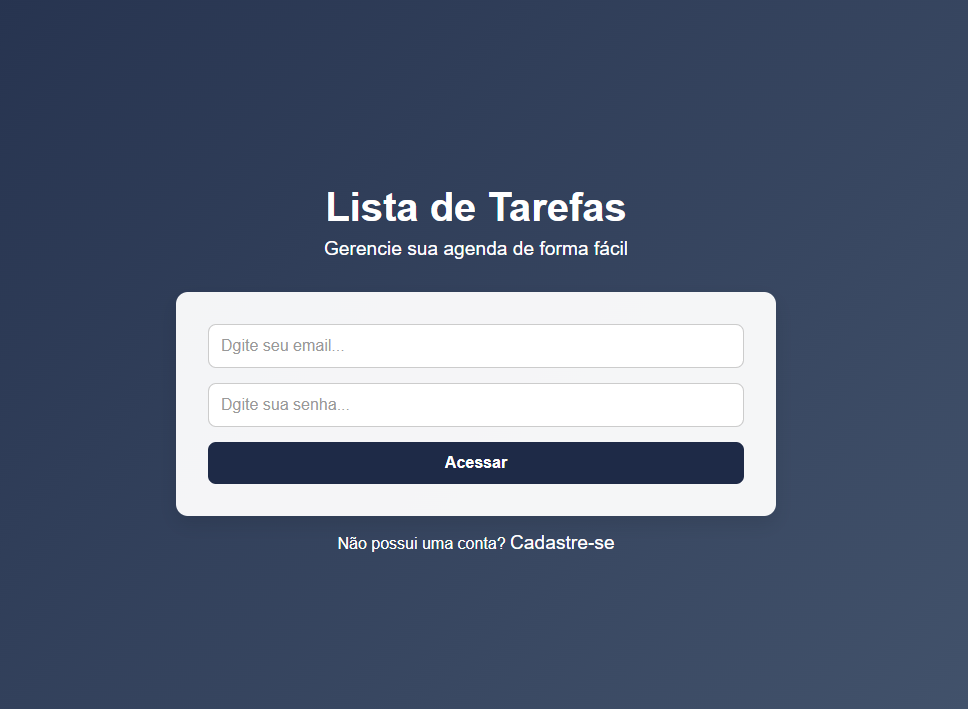
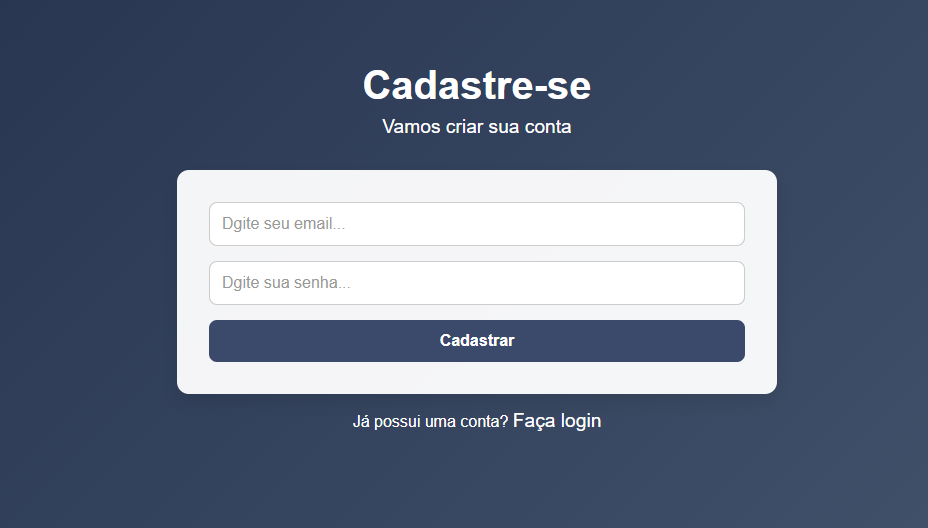
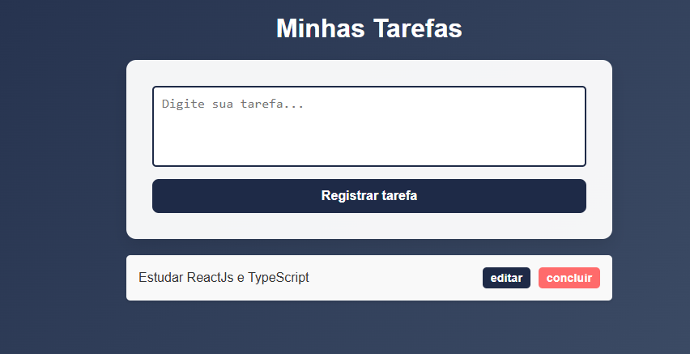
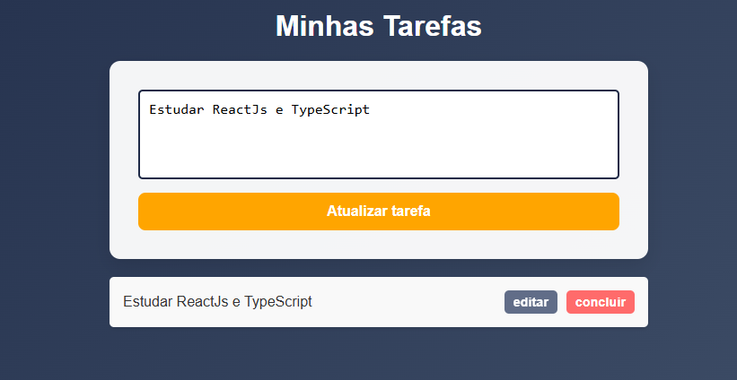

# 🎯 TaskManager

TaskManager é uma aplicação para gerenciamento de tarefas pessoais, onde os usuários podem adicionar, editar, remover e visualizar suas tarefas de forma simples e prática. O projeto utiliza **React** e Firebase para o armazenamento e autenticação dos dados.

---

### 🚀 Acesse o projeto:
🔗 [PrimeFlix - Clique aqui para acessar](https://primeflix-taupe.vercel.app/)

---

### 🔧 Tecnologias Utilizadas
- **React**: Biblioteca JavaScript para criação de interfaces.
- **Firebase**: Plataforma de backend para autenticação e armazenamento de dados.
- **React Router DOM**: Gerenciamento de rotas no React.
- **React Toastify**: Para notificações personalizadas.
- **Vercel**: Plataforma de hospedagem para o deploy.
- **CSS**: Estilização customizada no estilo Netflix.

---

### ⚙️ Funcionalidades
- **Criação de Tarefas**: Adicione novas tarefas rapidamente.
- **Edição de Tarefas**: Modifique tarefas existentes.
- **Autenticação de Usuário**: Faça login e logout usando Firebase.
- **Exclusão de Tarefas**: Remova tarefas concluídas.
- **Armazenamento de Dados**: As tarefas são armazenadas no Firebase.
- **Notificações**: Notificações de sucesso e erro com o estilo Toastify.
- **Responsividade**: Interface otimizada para diferentes tamanhos de tela.

---

### 🖼 Screenshots
#### Página Login

#### Página de Registro

#### Página de Admin/adiciando Tarefa

#### Página de Admin/editando Tarefa

---

### 📄 Licença
Este projeto está sob a licença MIT. Veja o arquivo [LICENSE](LICENSE) para mais detalhes.

---

### 👤 Autor
**Mathias Fuhr**  
- 🌐 [LinkedIn](https://www.linkedin.com/in/mathiasgilvanfuhr/)  
- 📧 mathiasgfuhr@gmail.com

